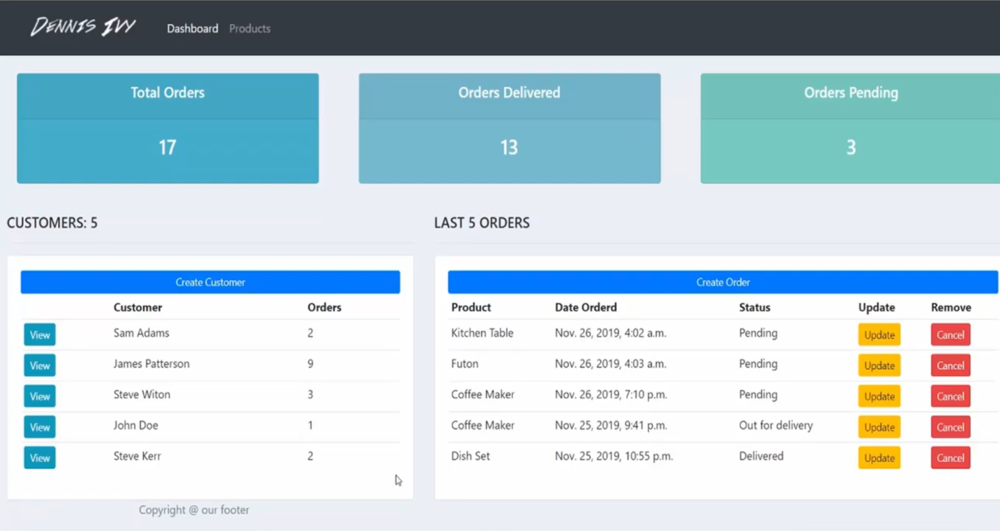

# crash-course-CRM

> This project is part of a YouTube tutorial: [Django CRM Crash Course](https://youtu.be/xv_bwpA_aEA?si=qoMvSpLT8gQ_RgcG)



A Django-based Customer Relationship Management (CRM) platform for managing customers, products, and orders. This project is designed as a crash course example demonstrating Django's core features including models, views, forms, and templates.

## Features

- **Dashboard**: Overview of orders, customers, and key metrics (total orders, delivered, pending)
- **Customer Management**: Create, view, and manage customer profiles with contact information
- **Product Management**: Manage product catalog with categories (Indoor/Out Door), pricing, and descriptions
- **Order Management**: Full CRUD operations for orders (Create, Read, Update, Delete)
- **Order Filtering**: Filter orders by status and other criteria
- **Order Tracking**: Track order status (Pending, Out for delivery, Delivered)

## Technologies Used

- **Django 4.2.26**: Python web framework (LTS version with security patches)
- **SQLite**: Database (default)
- **Bootstrap**: Frontend styling (via static files)
- **django-widget-tweaks**: Form rendering utilities
- **django-filter**: Filtering utilities for querysets

## Prerequisites

Before setting up the project, ensure you have the following installed:

- Python 3.8 or higher (recommended: Python 3.10+)
- pip (Python package manager)
- Git

## Installation & Setup

Follow these steps to get the application running on your local machine:

### 1. Clone the Repository

```bash
git clone https://github.com/dennisivy/crash-course-CRM.git
cd crash-course-CRM
```

### 2. Create a Virtual Environment

It's recommended to use a virtual environment to manage dependencies:

```bash
# Create virtual environment
python3 -m venv venv

# Activate virtual environment
# On Windows:
venv\Scripts\activate
# On macOS/Linux:
source venv/bin/activate
```

### 3. Install Dependencies

Install Django and required packages using the requirements file:

```bash
pip install -r requirements.txt
```

Or install packages individually:

```bash
pip install django==2.1.7
pip install django-widget-tweaks
```

### 4. Navigate to Project Directory

```bash
cd crm
```

### 5. Run Database Migrations

Set up the database by running migrations:

```bash
python manage.py migrate
```

### 6. Create a Superuser (Optional)

To access the Django admin panel, create a superuser account:

```bash
python manage.py createsuperuser
```

Follow the prompts to set up your admin username, email, and password.

### 7. Run the Development Server

Start the Django development server:

```bash
python manage.py runserver
```

The application will be available at `http://127.0.0.1:8000/`

## Usage

### Accessing the Application

1. **Main Dashboard**: Navigate to `http://127.0.0.1:8000/` to view the dashboard with order statistics and customer overview
2. **Products Page**: Go to `http://127.0.0.1:8000/products/` to view all products
3. **Customer Details**: Click on any customer to view their profile and associated orders
4. **Admin Panel**: Access `http://127.0.0.1:8000/admin/` to manage data through Django's admin interface

### Managing Data

#### Creating Orders
- Click "Create Order" button on the dashboard or customer page
- Fill in the order form with customer, product, and status information
- Submit to create a new order

#### Updating Orders
- Navigate to a customer's page to see their orders
- Click "Update" on any order to modify its details
- Change status, product, or other fields as needed

#### Deleting Orders
- From the customer page, click "Delete" on an order
- Confirm the deletion

#### Filtering Orders
- On customer pages, use the filter options to search orders by status or other criteria

### Adding Initial Data

You can add sample data through:

1. **Django Admin Panel**: 
   - Login at `/admin/`
   - Add Customers, Products, and Orders manually

2. **Django Shell**: 
   ```bash
   python manage.py shell
   ```
   Then create objects programmatically

## Project Structure

```
crash-course-CRM/
├── crm/                          # Main Django project directory
│   ├── accounts/                 # Main application
│   │   ├── migrations/           # Database migrations
│   │   ├── templates/            # HTML templates
│   │   │   └── accounts/         
│   │   │       ├── dashboard.html
│   │   │       ├── customer.html
│   │   │       ├── products.html
│   │   │       └── ...
│   │   ├── models.py             # Customer, Product, Order models
│   │   ├── views.py              # View functions
│   │   ├── urls.py               # URL routing
│   │   ├── forms.py              # Django forms
│   │   └── filters.py            # Order filtering
│   ├── crm/                      # Project settings
│   │   ├── settings.py           # Django settings
│   │   ├── urls.py               # Root URL configuration
│   │   └── wsgi.py               # WSGI configuration
│   ├── static/                   # Static files (CSS, JS, images)
│   └── manage.py                 # Django management script
└── README.md                     # This file
```

## Models

The application includes three main models:

- **Customer**: name, phone, email, date_created
- **Product**: name, price, category, description, date_created
- **Order**: customer (FK), product (FK), date_created, status

## Development Notes

- The project uses SQLite as the default database (development only)
- Secret key is hardcoded in settings.py (change this for production!)
- DEBUG mode is enabled (disable for production)
- Static files are served from the `/static/` directory
- The project uses Django 4.2.26 LTS with security patches for known vulnerabilities
- **Security**: Upgraded from Django 2.1.7 to address critical vulnerabilities:
  - Fixed denial-of-service vulnerability in HttpResponseRedirect
  - Fixed SQL injection vulnerability via _connector keyword argument

## Contributing

This is a crash course/tutorial project. Feel free to fork and modify for your learning purposes!

## License

This project is open source and available for educational purposes.
